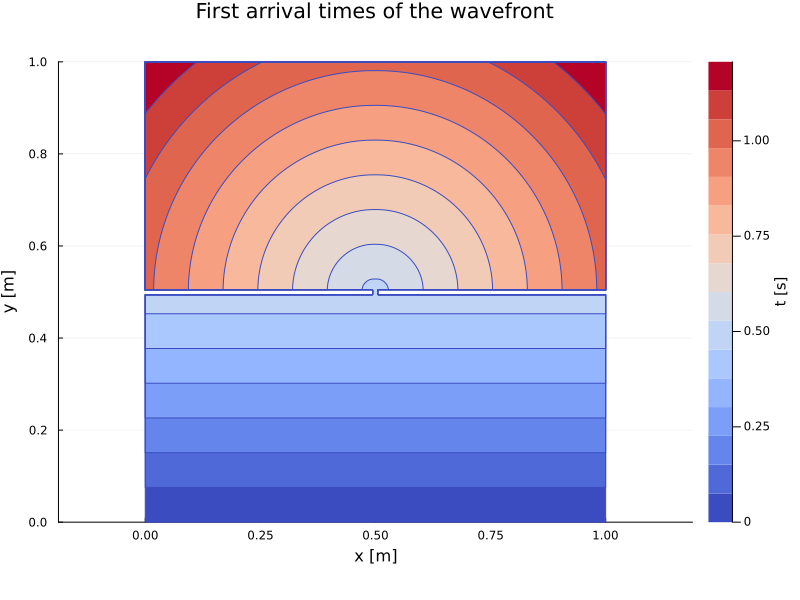

# Fast Sweeping & Fast Marching methods for the solution of eikonal equations

[](https://triscale-innov.github.io/Eikonal.jl/stable/)
[](https://triscale-innov.github.io/Eikonal.jl/dev/)
[](https://github.com/JuliaTesting/Aqua.jl)
[](https://github.com/triscale-innov/Eikonal.jl/actions/workflows/CI.yml?query=branch%3Amain)
[](https://codecov.io/gh/triscale-innov/Eikonal.jl)

Julia implementations of solvers for general Eikonal equations of the form

$$\begin{align}
&\left\Vert\nabla \tau\right\Vert = \sigma(x), && \forall x\in\Omega\subset\mathbb{R}^N,\\
&\tau(x_0) = 0, && \forall x_0\in\Gamma\subset\Omega,
\end{align}$$

where $\Omega$ is a rectangular, N-dimensional spatial domain, and $\tau(x)$ represents
the first arrival time at point $x$ of a front moving with slowness
$\sigma$ (i.e. speed $1/\sigma$) and originating from $\Gamma$.

This package provides implementations for two methods

- Fast Sweeping Method (FSM)  [1]
- Fast Marching Method (FMM)  [2]

[1] Zhao, Hongkai (2005-01-01). "A fast sweeping method for Eikonal equations". Mathematics of Computation. 74 (250): 603–627. [DOI: 10.1090/S0025-5718-04-01678-3](https://doi.org/10.1090%2FS0025-5718-04-01678-3)<br/>
[2] J.A. Sethian. A Fast Marching Level Set Method for Monotonically Advancing Fronts, Proc. Natl. Acad. Sci., 93, 4, pp.1591--1595, 1996. [PDF](https://math.berkeley.edu/~sethian/2006/Papers/sethian.fastmarching.pdf)

## Examples / Tutorials

### Distance to multiple source points

This first example uses the Fast Marching method to compute a field of
distances to a set of source points. It is equivalent to the example given by
the [FastMarching.jl](https://github.com/hellemo/FastMarching.jl) package.

````julia
using Eikonal, Plots

tsize = 1000

solver = FastMarching(tsize, tsize)
solver.v .= 1;

npoints = 10
for _ in 1:npoints
    (i, j) = rand(1:tsize, 2)
    init!(solver, (i, j))
end

march!(solver, verbose=true)

contour(solver.t, levels=30,
        aspect_ratio=1, c=:coolwarm, size=(800, 600),
        title = "Distance to a set of 10 source points")
````


### Water waves in a ripple tank

This example uses the Eikonal equation as a high-frequency approximation to
the wave propagation equation. It computes the time of first arrival of a
(water) wave front in a ripple tank. (The image links to the details)

[](docs/ripple-tank/ripple-tank.md)

### Path planning in a maze

This example uses the Fast Sweeping method to solve a 2D Eikonal equation in
order to find a shortest path in a maze. (The image links to the details)

[](docs/maze/maze.md)

### Moving a piano in a San Francisco apartment

This example uses the Fast Sweeping method to solve a 3D Eikonal equation in
order to find an optimal path when moving an object in a constrained space.
(The image links to the details)

[](docs/piano/piano.md)

---

*This page was generated using [Literate.jl](https://github.com/fredrikekre/Literate.jl).*

