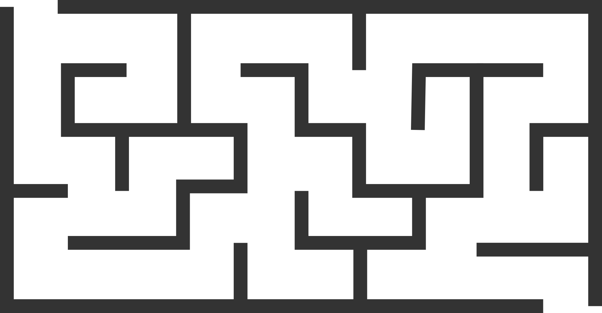
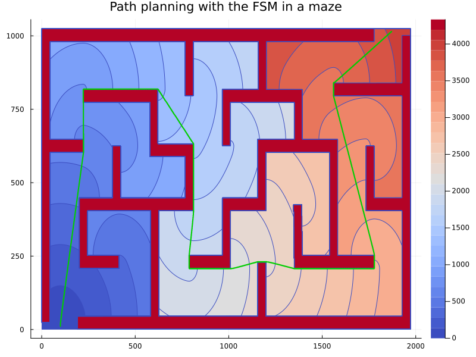

# Path planning in a maze

This example is also available in notebook form:
[](docs/readme/README.ipynb)
[](https://nbviewer.jupyter.org/github/triscale-innov/Eikonal.jl/blob/main/docs/readme/README.ipynb)

In this example, we solve an Eikonal equation in order to find a shortest path
in a maze described by the following picture:



We first load the package:

````julia
using Eikonal
````

We then create a solver object, in this case, we'll use the Fast Sweeping
Method and build a solver of type `FastSweeping`. A convenience function is
provided to create the solver from an image, in which case the grid size is
taken from the image size, and the slowness $\sigma$ is initialized based on
the pixel colors. Here, we'll consider walls (black pixels) to be
unreacheable: they have infinite slowness. White pixels have an (arbitrary)
finite slowness.

````julia
solver = FastSweeping("maze.png", ["white"=>1.0, "black"=>Inf])
````

NB: it would also have been possible to create an uninitialized solver providing only its grid size. The slowness field could then be initialized by accessing its internal field `v`:
```julia
(m,n) = 1000, 2000
fsm = FastSweeping(m, n)  # a FastSweeping solver operating on a m×n grid
fsm.v .= rand()           # initialize its slowness field
```

We then define the grid position of the maze entrance. It is entered as a boundary condition for the solver.

````julia
entrance = (10, 100)
init!(solver, entrance)
````

The eikonal equation can now be solved using the FSM, yielding a field of
first arrival times in each grid cell.

````julia
@time sweep!(solver, verbose=true, epsilon=1e-5)
````

First arrival times are infinite in some grid cells (since pixels inside walls
are unreacheable). We'll give them a large but finite value in order to avoid
problems when plotting. Since the arrival time at the maze goal is the largest
useful time value, we'll set the arrival times inside walls to be 10% more than that.

````julia
goal = size(solver.t) .- (10, 100)
tmax = solver.t[goal...]
solver.t .= min.(solver.t, 1.1*tmax);
````

The `ray` function can be used to find the shortest path from entrance to
goal, backtracking in the arrival times field. The ray is represented as a vector of grid coordinates:

````julia
r = ray(solver.t, goal)
````

Let's finally plot everything:

- arrival times are represented with color levels and contour lines;
- the shortest path from entrance to goal is represented as a thick green line.

````julia
using Plots

plot(title="Path planning with the FSM in a maze", dpi=300)
contour!(solver.t, levels=30, fill=true, c=:coolwarm)
plot!(last.(r), first.(r),
      linewidth=2, linecolor=:green3, label=nothing)
````



---

*This page was generated using [Literate.jl](https://github.com/fredrikekre/Literate.jl).*

