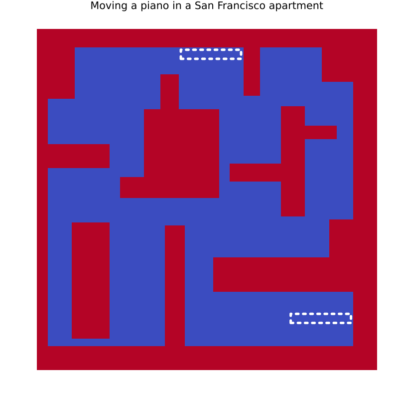

# Moving a piano in a San Francisco Apartment

This example is heavily inspired from the one presented on [Dr James Sethian's
page](https://math.berkeley.edu/~sethian/2006/Applications/Robotics/robotics.html).

It is also available in notebook form:
[](piano.ipynb)
[](https://nbviewer.jupyter.org/github/triscale-innov/Eikonal.jl/blob/main/docs/piano/piano.ipynb)

The objective of the problem proposed here is to determine a shortest path to
move an object in a constrained space without hitting the walls. When the
object shape is long (e.g. a piano) and the accessible space is very
constrained (e.g. an apartment with narrow doors and corridors), it will
become necessary to account for the orientation of the object. The problem is
therefore now posed in a 3-D $(x, y, θ)$ space, where $x$ and $y$ account for
the position of the center of the piano, and $θ$ its orientation.

Let's try and solve this with a 3-D Fast Sweeping solver.

We first load the required packages

````julia

using Eikonal
using Plots
using Images
````

The position of the walls is loaded from a PNG image.

````julia
walls = Eikonal.img2array(load("apartment.png"), ["white"=>false, "black"=>true])
heatmap(walls, c=:coolwarm,
        title = "Position of the walls",
        aspect_ratio=1, size=(800, 800),
        showaxis=false, legend=false, grid=false)
````


We then define a discrete set of directions. (Note that $θ=-π$ and $θ=π$ are
the same direction and should therefore be connected, but in this model we
consider them as entirely separate directions. This means that we won't be
able to find solutions in which the piano performs a complete 360° turn.)

````julia
const θ = LinRange(-π, π, 101)
````

Let's compute a 3-D slowness array indicating the set of valid positions and
orientations for the piano. A given position is invalid for a given
orientation if (and only if) some part of the piano touches the walls or falls
outside the domain. Such invalid positions and orientations are associated to
an infinite slowness. Conversely, valid positions and orientations are
associated to an (arbitrary) finite slowness.

````julia
const SIZE = (6, 40)

function slowness(walls, θ)
    σ = similar(walls, Float64, (axes(walls)..., axes(θ)...))
    (w, h) = (SIZE .÷ 2) .+ 1

    valid_indices = CartesianIndices(walls)
    for I in CartesianIndices(σ)
        i,j,k = Tuple(I)
        invalid = any(Iterators.product(-w:w, -h:h)) do (s1, s2)
            i′ = round(Int, i + s1*cos(θ[k]) - s2*sin(θ[k]))
            j′ = round(Int, j + s1*sin(θ[k]) + s2*cos(θ[k]))
            I′ = CartesianIndex(i′, j′)
            I′ ∈ valid_indices || return true
            return walls[I′]
        end
        σ[I] = invalid ? Inf : 1.0
    end

    σ
end

σ = slowness(walls, θ)
size(σ)
````

For example, let us represent the set of valid positions for the center of the
piano when $θ=0$:

````julia
heatmap(min.(σ[:,:,51], 2.), c=:coolwarm,
        title = "Valid positions when θ=0",
        aspect_ratio=1, size=(800, 800),
        showaxis=false, legend=false, grid=false)
````


We can now create a Fast Sweeping solver for this problem:

````julia
sol = FastSweeping(σ)
````

Let's assume for example that the piano comes into the apartment via the front
door at the bottom right corner of the map (this is the origin of the path),
and needs to go to the back room at the top (this is our destination). In both
positions, the piano should be horizontal ($θ=0$):

````julia
orig = (35,  189, 51)
dest = (210, 116, 51)

const LW = 4
const LC = :white

function piano_corners(pos)
    (w, h) = SIZE .÷ 2
    (i, j, k) = pos
    x = Float64[]; y = Float64[]
    for (s1, s2) in ((-1,-1), (-1,1), (1,1), (1, -1), (-1,-1))
        push!(x, i + s2*w*cos(θ[k]) - s1*h*sin(θ[k]))
        push!(y, j + s2*w*sin(θ[k]) + s1*h*cos(θ[k]))
    end
    (y, x)
end

function background()
    plot(title = "Moving a piano in a San Francisco apartment",
         aspect_ratio=1, size=(800, 800),
         showaxis=false, legend=false, grid=false)
    heatmap!(walls, c=:coolwarm)
    plot!(piano_corners(orig)..., label="", linecolor=LC, linestyle=:dot, linewidth=LW+1)
    plot!(piano_corners(dest)..., label="", linecolor=LC, linestyle=:dot, linewidth=LW+1)
end

background()
````



Let's run the solver, setting the source of the front at the origin. Hopefully
there exists a valid path, in which case we'll get a finite first arrival time
at the destination.

````julia
init!(sol, orig)
@time sweep!(sol, verbose=true, epsilon=1e-2)
@assert isfinite(sol.t[dest...])
````

The path itself can be retrieved by back-propagation from the destination to
the origin:

````julia
r = ray(sol.t, dest, Eikonal.NearestMin()) |> reverse!
````

````julia
anim = @animate for pos in r
    plt = background()
    plot!(plt, piano_corners(pos)..., label="", linecolor=LC, linewidth=LW)
end
gif(anim, "piano_traj.gif", fps=15)
````


---

*This page was generated using [Literate.jl](https://github.com/fredrikekre/Literate.jl).*

